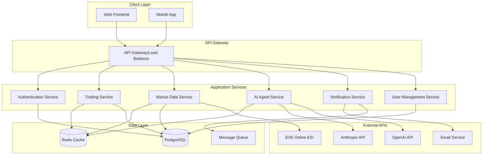

# Design Document

## Overview

The EVE Online Trading Assistant is a modern web application built with a microservices architecture that integrates multiple external APIs to provide AI-powered trading insights. The system follows a layered architecture with clear separation between data access, business logic, and presentation layers.

### Key Design Principles

- **Scalability**: Microservices architecture allows independent scaling of components
- **Reliability**: Comprehensive caching and fallback mechanisms ensure system availability
- **Security**: End-to-end encryption and secure credential management
- **Extensibility**: Plugin-based AI provider system allows easy integration of new services
- **Performance**: Intelligent caching reduces API calls and improves response times

## Architecture

### High-Level Architecture



### Service Architecture

The application is divided into six core microservices:

1. **Authentication Service**: Handles user authentication, API key management, and security
2. **Market Data Service**: Manages EVE Online market data fetching, caching, and historical tracking
3. **Trading Service**: Provides trading analysis, suggestions, and budget management
4. **AI Agent Service**: Orchestrates AI provider interactions and manages fallback logic
5. **Notification Service**: Handles alerts, notifications, and communication preferences
6. **User Management Service**: Manages user profiles, preferences, and account data

## Components and Interfaces

### Authentication Service

**Responsibilities:**

- User registration and login
- EVE Online API key validation and storage
- JWT token management
- Encryption/decryption of sensitive data

**Key Interfaces:**

```typescript
interface AuthService {
  authenticateUser(credentials: UserCredentials): Promise<AuthToken>;
  validateEveApiKey(apiKey: string): Promise<EveApiKeyInfo>;
  encryptSensitiveData(data: string): Promise<string>;
  decryptSensitiveData(encryptedData: string): Promise<string>;
  refreshToken(token: string): Promise<AuthToken>;
}

interface EveApiKeyInfo {
  characterId: number;
  characterName: string;
  scopes: string[];
  expiresAt: Date;
  isValid: boolean;
}
```

### Market Data Service

**Responsibilities:**

- Fetch market data from EVE Online ESI
- Implement intelligent caching with TTL management
- Store historical price data
- Manage rate limiting and API quotas

**Key Interfaces:**

```typescript
interface MarketDataService {
  getMarketData(regionId: number, typeId: number): Promise<MarketData>;
  getHistoricalData(regionId: number, typeId: number, days: number): Promise<HistoricalData[]>;
  addToWatchlist(userId: string, items: WatchlistItem[]): Promise<void>;
  getWatchlistAlerts(userId: string): Promise<Alert[]>;
}

interface MarketData {
  typeId: number;
  regionId: number;
  buyOrders: Order[];
  sellOrders: Order[];
  lastUpdated: Date;
  volume: number;
  averagePrice: number;
}

interface CacheStrategy {
  ttl: number; // Time to live in seconds
  refreshThreshold: number; // Percentage of TTL when to refresh
  maxStaleTime: number; // Maximum time to serve stale data
}
```

### Trading Service

**Responsibilities:**

- Generate AI-powered trading suggestions
- Manage user budgets and trading plans
- Calculate profit margins and risk assessments
- Track trading performance

**Key Interfaces:**

```typescript
interface TradingService {
  generateTradingSuggestions(userId: string, budget: number): Promise<TradingSuggestion[]>;
  createTradingPlan(userId: string, parameters: TradingPlanParams): Promise<TradingPlan>;
  updateBudget(userId: string, newBudget: number): Promise<void>;
  trackTradeExecution(userId: string, trade: ExecutedTrade): Promise<void>;
}

interface TradingSuggestion {
  itemId: number;
  itemName: string;
  buyPrice: number;
  sellPrice: number;
  expectedProfit: number;
  profitMargin: number;
  riskLevel: 'LOW' | 'MEDIUM' | 'HIGH';
  requiredInvestment: number;
  timeToProfit: number;
  confidence: number;
}
```

### AI Agent Service

**Responsibilities:**

- Manage multiple AI provider integrations
- Implement failover logic between providers
- Cache AI responses to reduce API costs
- Format and standardize AI responses

**Key Interfaces:**

```typescript
interface AIAgentService {
  analyzeMarketData(marketData: MarketData[], context: AnalysisContext): Promise<MarketAnalysis>;
  generateTradingAdvice(
    userProfile: UserProfile,
    marketConditions: MarketConditions
  ): Promise<TradingAdvice>;
  explainTradingStrategy(suggestion: TradingSuggestion): Promise<string>;
}

interface AIProvider {
  name: string;
  isAvailable(): Promise<boolean>;
  generateResponse(prompt: string, context: any): Promise<AIResponse>;
  estimateCost(prompt: string): number;
}

interface AIProviderManager {
  registerProvider(provider: AIProvider): void;
  getAvailableProvider(): Promise<AIProvider>;
  executeWithFailover(operation: AIOperation): Promise<AIResponse>;
}
```

## Data Models

### Core Entities

```typescript
// User and Authentication
interface User {
  id: string;
  email: string;
  username: string;
  createdAt: Date;
  preferences: UserPreferences;
  subscription: SubscriptionInfo;
}

interface EveCharacter {
  characterId: number;
  characterName: string;
  corporationId: number;
  allianceId?: number;
  apiKey: string; // Encrypted
  scopes: string[];
  lastSync: Date;
}

// Market Data
interface MarketOrder {
  orderId: number;
  typeId: number;
  regionId: number;
  locationId: number;
  price: number;
  volume: number;
  minVolume: number;
  duration: number;
  issued: Date;
  isBuyOrder: boolean;
}

interface PriceHistory {
  typeId: number;
  regionId: number;
  date: Date;
  highest: number;
  lowest: number;
  average: number;
  volume: number;
  orderCount: number;
}

// Trading
interface TradingPlan {
  id: string;
  userId: string;
  budget: number;
  riskTolerance: 'CONSERVATIVE' | 'MODERATE' | 'AGGRESSIVE';
  suggestions: TradingSuggestion[];
  createdAt: Date;
  status: 'ACTIVE' | 'PAUSED' | 'COMPLETED';
}

interface Watchlist {
  id: string;
  userId: string;
  name: string;
  items: WatchlistItem[];
  alerts: AlertRule[];
}

interface WatchlistItem {
  typeId: number;
  regionId: number;
  targetBuyPrice?: number;
  targetSellPrice?: number;
  addedAt: Date;
}
```

### Database Schema Design

**Users Table:**

- Primary key: UUID
- Indexes: email, username
- Encryption: API keys, sensitive personal data

**Market Data Tables:**

- Partitioned by region and date for performance
- Indexes: typeId, regionId, timestamp
- TTL policies for historical data cleanup

**Cache Strategy:**

- Redis for real-time market data (5-15 minute TTL)
- Application-level caching for AI responses (1 hour TTL)
- Database query result caching (30 minutes TTL)

## Error Handling

### API Error Management

```typescript
interface ErrorHandler {
  handleEsiError(error: EsiError): Promise<ErrorResponse>;
  handleAiProviderError(error: AiProviderError): Promise<ErrorResponse>;
  handleDatabaseError(error: DatabaseError): Promise<ErrorResponse>;
}

interface ErrorResponse {
  code: string;
  message: string;
  retryable: boolean;
  fallbackAction?: string;
  userMessage: string;
}
```

### Graceful Degradation Strategy

1. **ESI API Unavailable**: Serve cached market data with staleness indicators
2. **AI Provider Down**: Fallback to alternative provider or basic algorithmic analysis
3. **Database Issues**: Use read replicas and cached data where possible
4. **Cache Failures**: Direct API calls with circuit breaker pattern

### Rate Limiting and Backoff

```typescript
interface RateLimiter {
  checkLimit(service: string, userId?: string): Promise<boolean>;
  executeWithBackoff<T>(operation: () => Promise<T>): Promise<T>;
  getRetryDelay(attemptNumber: number): number;
}

// Exponential backoff: 1s, 2s, 4s, 8s, 16s (max)
const BACKOFF_MULTIPLIER = 2;
const MAX_BACKOFF_DELAY = 16000;
const BASE_DELAY = 1000;
```

## Testing Strategy

### Unit Testing

- Service layer business logic
- Data transformation functions
- AI response parsing and validation
- Caching mechanisms

### Integration Testing

- ESI API integration with mock responses
- AI provider failover scenarios
- Database operations and migrations
- Cache invalidation strategies

### End-to-End Testing

- Complete user workflows (registration → trading suggestions)
- API rate limiting behavior
- Real-time notification delivery
- Cross-service communication

### Performance Testing

- Market data ingestion under load
- Concurrent user trading analysis
- Cache hit/miss ratios
- AI provider response times

### Security Testing

- API key encryption/decryption
- Authentication token validation
- SQL injection prevention
- Rate limiting bypass attempts

## Security Considerations

### Data Protection

- AES-256 encryption for API keys and sensitive data
- TLS 1.3 for all external communications
- Database encryption at rest
- Secure key management with rotation policies

### Authentication & Authorization

- JWT tokens with short expiration (15 minutes)
- Refresh token rotation
- Role-based access control (RBAC)
- API rate limiting per user and IP

### Privacy Compliance

- GDPR-compliant data deletion
- User consent management
- Data minimization principles
- Audit logging for sensitive operations

## Deployment and Infrastructure

### Container Strategy

- Docker containers for each microservice
- Kubernetes orchestration for scaling
- Health checks and readiness probes
- Rolling deployments with zero downtime

### Monitoring and Observability

- Application metrics (Prometheus)
- Distributed tracing (Jaeger)
- Centralized logging (ELK stack)
- Real-time alerting (PagerDuty)

### Backup and Recovery

- Automated database backups (daily)
- Point-in-time recovery capability
- Cross-region data replication
- Disaster recovery procedures

This design provides a robust, scalable foundation for the EVE Online Trading Assistant while addressing all requirements including responsible third-party service usage, security, and user experience.
