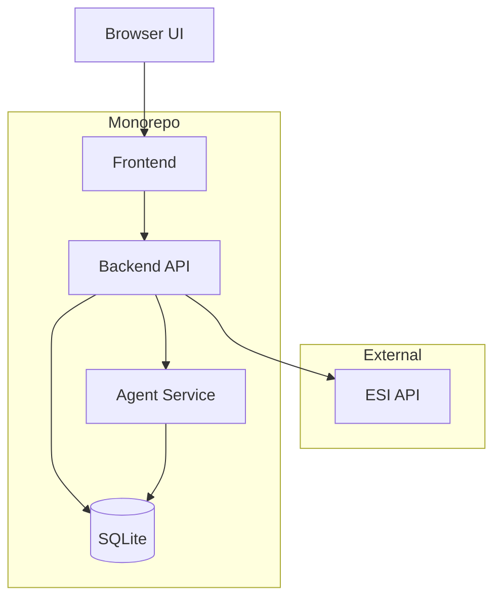

## EVE Jita AI Trader — Monorepo (Docs-Only Bootstrap)

This repository bootstraps a monorepo for a web app that suggests profitable market orders in EVE Online, focusing initially on the main trade hub (Jita, The Forge). The repository now includes monorepo scaffolding and minimal TypeScript packages; core application logic is not implemented yet.

The app will leverage EVE's ESI API with strict adherence to best practices, including proper user agent identification, error-limit handling, and cache-aware data fetching. Refer to the ESI best practices documentation: [ESI Best Practices](https://developers.eveonline.com/docs/services/esi/best-practices/).

### Status

- Monorepo scaffolding in place (npm workspaces, TypeScript base config, lint/format, tests, CI). [T-01] complete.
- Backend ESI client + SQLite cache layer implemented with User-Agent, ETag/If-None-Match, and retry/backoff; tested. [T-02] complete.
- Backend market snapshot ingestion for The Forge with pagination consistency checks and Jita filtering, exposed via `fetchForgeJitaOrderSnapshots`. [T-03] complete.
- SQLite migrations added for `suggestion_run` and `suggested_order`, with a migration runner `runSqliteMigrations`. [T-04] complete.
- Agent baseline will leverage Anthropic to produce structured suggestions from aggregated market features. Default model: `claude-sonnet-4-20250514` (override via `ANTHROPIC_MODEL`). [T-05] planned (Anthropic-powered).

## Scope and Principles

- Suggest market orders within a specified budget to maximize expected profit.
- Initial scope limited to Jita (system 30000142 in The Forge region 10000002) for simplicity and performance.
- Read-only interaction with the ESI API; no in-game automation of order placement.
- SQLite is the initial data store. Future upgrades can introduce alternative databases via adapters.
- Strict compliance with third-party API etiquette: caching, backoff, and error-limit respect.
- Agent uses Anthropic models server-side only; configure `ANTHROPIC_API_KEY`. Default model `claude-sonnet-4-20250514`, override via `ANTHROPIC_MODEL`. Outputs validated against schema before persistence.

## Monorepo Overview

Proposed structure for AI agents to implement:

```text
/
  README.md
  docs/
    AI_AGENT_GUIDE.md
    TODO.md
  packages/
    backend/            # API server, ESI integration, data ingestion, business logic
    frontend/           # Web UI for exploring data and suggested orders
    agent/              # AI/heuristic engines that generate suggestions
    shared/             # Cross-cutting utils, type definitions, schemas
  infra/                # IaC, containerization, deployment workflows
  scripts/              # Developer and data maintenance scripts
  data/                 # SQLite database files (local dev), seeds, exports
```

### High-Level Architecture



Key points:

- The backend is the sole component that speaks to ESI. It injects the correct user agent headers, handles caching via `ETag`/`If-None-Match`, respects `expires`/`last-modified`, and implements error-limit backoff. See: [ESI Best Practices](https://developers.eveonline.com/docs/services/esi/best-practices/).
- The agent consumes normalized market snapshots from SQLite and emits suggested orders with clear justifications and risk flags.
- The frontend provides exploration and decision support; it does not place orders.

## Data Model (Initial)

This is a proposed starting point for agents. Actual schemas may evolve.

```mermaid
erDiagram
  item_type {
    int type_id PK
    string name
    string group_name
  }
  market_order_snapshot {
    string snapshot_id PK
    int region_id
    int system_id
    int type_id FK
    string side  // buy|sell
    decimal price
    int volume
    datetime issued_at
    datetime snapshot_ts
  }
  price_history_daily {
    int region_id
    int type_id FK
    date day
    decimal avg_price
    int volume
  }
  suggestion_run {
    string run_id PK
    datetime started_at
    datetime finished_at
    string strategy
    decimal budget
  }
  suggested_order {
    string suggestion_id PK
    string run_id FK
    int type_id FK
    string side  // buy|sell
    int quantity
    decimal unit_price
    decimal expected_margin
    string rationale
  }
  esi_cache_entry {
    string cache_key PK
    string url
    string etag
    datetime expires_at
    datetime last_modified
    datetime fetched_at
    int http_status
  }

  item_type ||--o{ market_order_snapshot : has
  item_type ||--o{ price_history_daily : has
  suggestion_run ||--o{ suggested_order : contains
```

## Compliance and 3rd-Party Etiquette

- Identify the application using a meaningful user agent value including app name, version, and contact (email and/or source URL). If running in a browser, use `X-User-Agent` or a `user_agent` query parameter fallback. Details: [ESI Best Practices](https://developers.eveonline.com/docs/services/esi/best-practices/).
- Respect ESI error-limits using `X-ESI-Error-Limit-Remain` and `X-ESI-Error-Limit-Reset`. Back off proactively as thresholds are approached.
- Be cache-aware: honor `expires` and `last-modified`, use `ETag` and `If-None-Match` to obtain `304` responses when appropriate.
- For paginated endpoints, ensure `last-modified` is consistent across pages; otherwise, refetch to avoid partial snapshots.
- Avoid scraping behavior. Fetch only what is needed for Jita-focused analysis, at reasonable intervals.

## Next Steps

- Start with `docs/AI_AGENT_GUIDE.md` to align on development practices, ESI integration rules, Anthropic usage, and data-handling patterns.
- Use `docs/TODO.md` to pick the next high-impact task with clear dependencies.

## References

- EVE ESI documentation and best practices: [ESI Best Practices](https://developers.eveonline.com/docs/services/esi/best-practices/)
