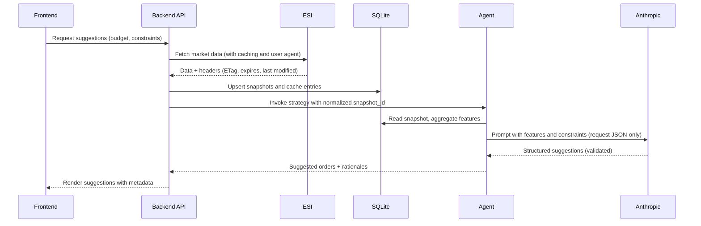

## AI Agent Implementation Guide

This guide defines how AI coding agents should work on this codebase. Follow these conventions to ensure correctness, compliance, and maintainability. When in doubt, prioritize the ESI best-practices and respectful behavior toward third-party systems.

Key reference: [ESI Best Practices](https://developers.eveonline.com/docs/services/esi/best-practices/)

### Mission

- Build a web app that suggests profitable market orders at Jita within a specified budget.
- Only read data; do not place orders. Provide transparent rationales and risk flags.
- The Agent initially uses the Anthropic API to analyze normalized market snapshots and produce suggestions with structured outputs.

## Ground Rules

- Always follow the ESI best practices when interacting with ESI.
- Prefer server-side ESI access to ensure proper header control and secret management.
- Treat SQLite as the source of truth for normalized market snapshots and suggestions.
- Keep the design modular so alternative data stores or strategies can be swapped in later.

## Tech and Repository Conventions

- Monorepo with npm workspaces. Use TypeScript across backend, frontend, and agent packages.
- Organize code under `packages/backend`, `packages/frontend`, `packages/agent`, and `packages/shared`.
- Enforce consistent formatting, linting, and type-checking. Use testing at unit and integration levels.
- Document decisions in `docs/` with concise rationale when deviating from this guide.

### LLM Provider and Usage (Anthropic)

- Provider: Anthropic (Claude family). Default model: `claude-sonnet-4-20250514`. Override via `ANTHROPIC_MODEL`.
- Access: Server-side only from `packages/agent` to keep keys secure. Configure via environment variable `ANTHROPIC_API_KEY`.
- I/O: The Agent prompts Anthropic with summary features derived from snapshots and requests JSON-only structured output for `suggestion_run` and `suggested_order` records.
- Guardrails:
    - Token and cost awareness: bound prompt size by sampling/aggregation; cap max tokens in responses.
    - Determinism: constrain with explicit instructions, JSON schema, and validation; reject/repair malformed outputs.
    - Privacy: do not send secrets or any PII. Only send derived, non-sensitive market features.
    - Rate limits: implement retry with backoff on 429/5xx responses from Anthropic; log usage.

Production note: Prefer explicit snapshot IDs (e.g., `claude-sonnet-4-20250514`) over aliases for stability. Do not reference Opus variants in this project by default.

## ESI Integration Requirements

Follow these rules for every outgoing request to ESI:

- Identify the application via user agent metadata:
    - Server-side: set `User-Agent` to a value such as:
        - `eve-jita-ai-trader/0.1.0 (contact@example.com; +https://github.com/ORG/REPO)`
    - Browser-side: prefer `X-User-Agent`. If headers are not possible, use the `user_agent` query parameter. See: [ESI Best Practices](https://developers.eveonline.com/docs/services/esi/best-practices/).
- Respect error limits:
    - Monitor `X-ESI-Error-Limit-Remain` and `X-ESI-Error-Limit-Reset`.
    - Implement exponential backoff with full jitter before limits are reached.
    - Stop or drastically reduce concurrency when approaching the limit.
- Respect caching:
    - Record `ETag`, `expires`, and `last-modified` with each response.
    - Send `If-None-Match` with the last `ETag` for subsequent requests to get `304` when data is unchanged.
    - Honor `expires` by not refreshing early unless an explicit user-initiated refresh occurs. Refer to: [ESI Best Practices](https://developers.eveonline.com/docs/services/esi/best-practices/).
    - For pagination, ensure `last-modified` is stable across pages; refetch if not.
- Retries and resilience:
    - Retry transient errors (network, 5xx, 429) with exponential backoff and jitter.
    - Use a circuit-breaker to avoid hammering ESI during incident windows. The backend `EsiClient` implements a breaker with configurable thresholds, half-open probing, and preemptive open when `X-ESI-Error-Limit-Remain` is critically low. The server degrades gracefully by returning 503 with the latest available run.
    - Persist partial results only with a clear `snapshot_id` and consistency checks.

### ESI Endpoints (Initial Focus)

- Market orders for The Forge: `/markets/{region_id}/orders/` (region_id = 10000002)
- Price history: `/markets/{region_id}/history/`
- Type and price references: `/markets/prices/`, SDE for `type_id` metadata

Fetch frequency must be bounded and cache-aware. Do not refetch within `expires` unless explicitly requested.

## Data Handling and SQLite

- Use SQLite with WAL mode for stability during concurrent reads.
- Store raw response metadata in an `esi_cache_entry` table to support `ETag`/`If-None-Match` and debugging.
- Normalize market data into snapshot tables keyed by `snapshot_id` for atomicity.
- Keep one-way migrations in `packages/backend/migrations`.

### Suggested Initial Tables

- `item_type(type_id PK, name, group_name)`
- `market_order_snapshot(snapshot_id PK, region_id, system_id, type_id FK, side, price, volume, issued_at, snapshot_ts)`
- `price_history_daily(region_id, type_id FK, day, avg_price, volume)`
- `suggestion_run(run_id PK, started_at, finished_at, strategy, budget)`
- `suggested_order(suggestion_id PK, run_id FK, type_id FK, side, quantity, unit_price, expected_margin, rationale)`
- `esi_cache_entry(cache_key PK, url, etag, expires_at, last_modified, fetched_at, http_status)`

### Agent Structured Output Contract

- The Agent must return structured data that maps directly to the SQLite schema:
    - `SuggestionRun`: `{ run_id, started_at, finished_at, strategy, budget }`
    - `SuggestedOrder`: `{ suggestion_id, run_id, type_id, side, quantity, unit_price, expected_margin, rationale }`
- Validate all LLM outputs against this contract (e.g., with Zod) before persistence or API exposure.

## Agent Design Principles

- Deterministic inputs, explainable outputs: include supporting features and rationale alongside each suggestion.
- Budget-aware portfolio: enforce max capital at risk, per-item caps, and diversification thresholds.
- Conservative assumptions: under-estimate sell prices and over-estimate fees to avoid unrealistic profit claims.
- Reproducibility: every suggestion belongs to a `suggestion_run` with parameters and derived metrics.

### LLM-Oriented Strategy Notes

- The baseline strategy leverages Anthropic to synthesize opportunities from buy/sell ladders at Jita using conservative fee assumptions and minimum volume thresholds.
- The prompt includes only aggregated features per `type_id` (e.g., best bid/ask, spread, spread%, available volume) to stay within token budgets.
- The Agent requests a JSON-only response conforming to the schema above; responses are validated and non-conforming items are dropped with clear logs.

### End-to-End Flow

## Security and Privacy

- Never commit secrets. Use environment variables for SSO client credentials.
- Store minimal PII; primarily item and market data. Do not store access tokens longer than necessary.
- Log only what is necessary for observability; scrub tokens and sensitive headers.

## Quality Bar

- Tests: unit (strategy math, data shaping) and integration (ESI client, caching behavior). Add backtests with historical data.
- Linting and formatting: consistent across packages.
- Type-safety: exported APIs and DTOs explicitly typed.
- Observability: structured logs, correlation IDs, request outcome metrics, error-limit metrics.
    - Backend `EsiClient` emits structured logs for backoff events (`esi_backoff`) and request summaries (`esi_request`).
    - After a run, the server logs a concise `esi_metrics_summary` and includes an `esi` telemetry object in `POST /api/suggestions/run` responses.
    - Programmatic access to in-process ESI metrics is available via `EsiClient#getMetrics()`.

## Development Workflow

- Branching: short-lived feature branches; merge via PR with review checklist.
- Commits: Conventional Commits (e.g., `feat:`, `fix:`, `docs:`).
- PRs: include a brief design note and testing evidence.
- Releases: semantic versioning; propagate user agent version accordingly.

## Links

- ESI best practices: [ESI Best Practices](https://developers.eveonline.com/docs/services/esi/best-practices/)
- Project README: `../README.md`
- Anthropic: `https://docs.anthropic.com/`
